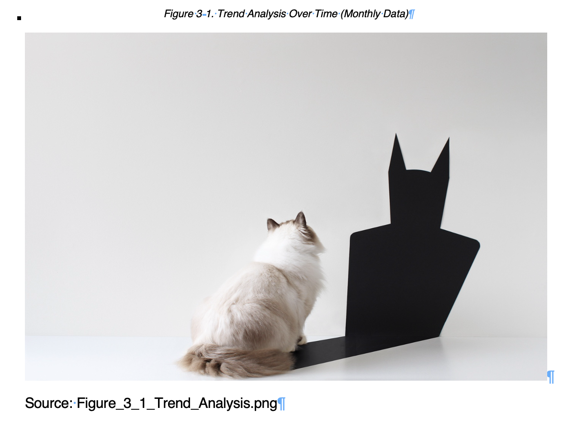

```{r, include = FALSE}
knitr::opts_chunk$set(
  collapse = TRUE,
  comment = "#>"
)
```

```{r, eval=FALSE}
# Install and load rdocx
library(rdocx)

# Load other required packages
library(flextable)
library(magrittr)
```

# Introduction

In this vignette we demonstrate using the `rdocx` package for updating and automatically adding tables and figures in a docx file with the following workflow:

1.  The user populates a yml file with the names of tables and figures to be updated or added.
2.  The user updates the docx report by executing the appropriate `rdocx` function in the console and passing the yml file location as an argument.
3.  The user inspects the docx report to ensure that the tables and figures have been updated correctly.

❗{rdocx} has been developed to work with "Generic Report" style documents, you can find an example at `use_cases/02_automated_reporting/Automated_Reporting_Example.docx`. It assumes that the Word document will have a specific format. Therefore, unexpected behavior can be found if the following guidelines are not followed:

-   Captions or titles are expected to be on top of figures and tables

-   Captions are expected to be followed by a placeholder/temporary figure or table

💪 {rdocx} currently supports **.csv** format for tables and **.jpeg, .png, .bmp** and **.pdf** for figures.

# 1. Writing the yml file

In the `rdocx` package, you can find an example of a yml file here: `use_cases/02_automated_reporting/example_yml_1`

The yml file should have a predefined structure and parameters to be set:

-   `type`. Indicates if it is a table (TBL) or a figure (FIG)

-   `title`. The title or caption of the table/figure in the template docx file. This will be used to search for the figure/table in the template docx document, and it will remain the same in the updated docx document.

-   `file`. The name of the file (csv or image) to be used in the new version of the docx.

-   `widths`. For tables only, a pre-defined column widths (useful for model parameter table, for example).

-   `occurrence`. Integer. To be used when captions are duplicated for more than one figure/table to define the order they appear in the docx document.

Below is an example of the yaml structure:

```         
output_1: 
  type: TBL 
  title: "Caption of the output 1" 
  file: output_1.csv 

output_2: 
  type: FIG 
  title: "Caption of the output 2" 
  file: output_2.png
  
output_3: 
  type: TBL 
  title: "Caption of the output 3" 
  file: output_3.csv
  widths: c(0.6,0.2,0.2)
  occurrence: 1
  
output_4: 
  type: TBL 
  title: "Caption of the output 3" 
  file: output_4.csv
  occurrence: 2
```

# 2. Updating the docx report

## Replace Outputs Class

To update figures and tables in a docx document, the `rdocx` class `ReplaceOutputs` should be used. Each attribute of the class has a restricted set of entries that are checked once the input is provided. For example, the class will make sure that the files passed as attributes exist and that they have the correct extension.

There are four parameter that the user has to define:

-   `template_docx_filename`: String. File name of the docx file that should be updated. For example, "/path/to/file/filename.docx"

-   `outputs_path`: String. Path to the folder with the outputs (figures and tables-csvs) that will be added to the new version of the docx

-   `doc_final_filename`: String. File name of the updated version of the docx file. For example, "/path/to/file/filename_updated.docx"

-   `yml_filename`: String. File name of the yml file that will guide the replacement of the outputs (tables and figures) in the updated docx file. For example, "/path/to/file/filename.yml"

```{r, eval=FALSE}
uo <- rdocx::ReplaceOutputs$new(
  template_docx_filename = "/path/to/file/filename.docx",
  outputs_path = "path/to/outputs",
  doc_final_filename = "./updated_filename.docx",
  yml_filename = "/path/to/file/filename.yml"
  )
```

```{r, eval=FALSE}
uo <- rdocx::ReplaceOutputs$new(
  template_docx_filename = system.file(
    "use_cases/02_automated_reporting",
    "Automated_Reporting_Example.docx",
    package="rdocx"
  ),
  outputs_path = system.file(
    "use_cases/02_automated_reporting/example_outputs",
    package="rdocx"
  ),
  doc_final_filename =  "./test.docx",
  yml_filename = system.file(
    "use_cases/02_automated_reporting",
    "example_yml_1.yml",
    package="rdocx"
  )
)
```

## Automatic yaml file creation

As explained above, the `ReplaceOuptuts` class needs a yml file with a predefined structure as input. This yml file can be created manually or automatically using `get_captions_to_yml()`. This method requires only the location of the automatically created yml file as input.

To use this functionality, an element of the `ReplaceOuptuts` class has to be created first without defining the `yml_filename` parameter. After that, the method can be called, and the new yml file will be created in the specified location:

```{r, eval=FALSE}
uo <- rdocx::ReplaceOutputs$new(
  template_docx_filename = "/path/to/file/filename.docx",
  outputs_path = "path/to/outputs",
  doc_final_filename = "./updated_filename.docx"
)

uo$get_captions_to_yml(yml_caption_filename="/path/to/file/filename.yml")
```

In the background, `get_captions_to_yml()` scans for all figures and tables in the docx file and populates the yml file with the corresponding information (`type` and `title`). If the user defines in the docx file the source of the figure or caption below the placeholder image or table ("Source:"), it will assign this information to the `file` parameter in the yml file.

⚠️ Be sure to specify correctly the path to the source figure or table. The path will be built joining the outputs paths and the source path.

{width="50%"}

Once the yml file is created, the user can manually add the missing information if needed (`file`, `widhts`, `occurrence`). If no `file` is provided, the output will be skipped and will remain unchanged.

Finally, this new yml file can be reassigned to the element of `ReplaceOutputs`:

```{r, eval=FALSE}
uo$yml_filename <- "/path/to/file/filename.yml"
```

```{r, eval=FALSE}
uo <- rdocx::ReplaceOutputs$new(
  template_docx_filename = system.file(
    "use_cases/02_automated_reporting",
    "Automated_Reporting_Example.docx",
    package="rdocx"
  ),
  outputs_path = system.file(
    "use_cases/02_automated_reporting/example_outputs",
    package="rdocx"
  ),
  doc_final_filename =  "./test.docx"
)

uo$get_captions_to_yml(yml_caption_filename="./test.yml")

uo$yml_filename <- "./test.yml"
```

## Update all outputs at once

Once the user has created an element of the `ReplaceOuptuts` class, the method `update_all_outputs()` can be used to update all the tables and figures defined in the yml file. No parameters have to be defined and, in the background, it iterates through all the outputs in the yml file, and assigns them in the correct location in the updated docx file with the correct format.

```{r, eval=FALSE}
uo <- rdocx::ReplaceOutputs$new(
  template_docx_filename = system.file(
    "use_cases/02_automated_reporting",
    "Automated_Reporting_Example.docx",
    package="rdocx"
  ),
  outputs_path = system.file(
    "use_cases/02_automated_reporting/example_outputs",
    package="rdocx"
  ),
  doc_final_filename =  "./test.docx",
  yml_filename = system.file(
    "use_cases/02_automated_reporting",
    "example_yml_1.yml",
    package="rdocx"
  )
)
```

```{r, eval=FALSE}
uo$update_all_outputs()
```

# 3. Inspect the updated docx report

You should now have rendered your docx file in the location `doc_final_filename`. **Please, review the rendering to ensure it is as expected.**

## Logging your settings and session info

The `update_all_outputs()` function also logs information to aid reproducibility and traceability. The log file will be written to the same location as the `doc_final_filename`. The log file will contain the following information:

-   The path to the original and final docx document

-   The outputs folder and yml file location

-   The name of the figures/tables changed, and the path of the new figure/table added

-   The path from where your R libraries are loaded (i.e. the package bundle version)

-   The R session info provided by `sessionInfo()`

👀 If you encounter an error please [raise an issue](https://github.com/Novartis/rdocx/issues) for the {rdocx} package team.
